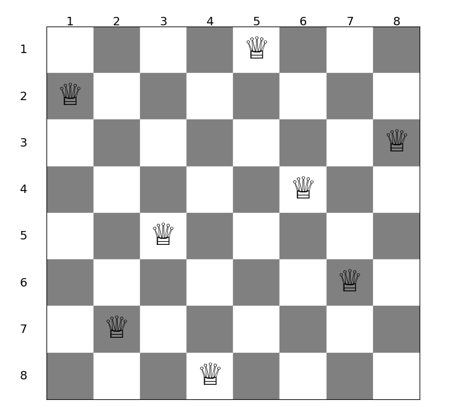

# N-Queens Problem

<p align="center">
	
</p>

## Description
The N-Queens Problem is a classic combinatorial problem that involves placing N queens on an N x N chessboard such that no two queens threaten each other. This project specifically solves the **8-Queens Problem**, where eight queens are placed on an 8x8 chessboard. 

This project utilizes the Gurobi optimization library to find the optimal arrangement of queens and visualize the solution on a chessboard.

## Mathematical Modeling
The problem can be formulated as follows:

```latex
\[
\begin{align*}
\max \quad & \sum_{i=1}^{8} \sum_{j=1}^{8} x(i,j) \quad  \textit{\textbf{Maximize the total number of queens}}\\
\text{s.t} \quad & \sum_{j=1}^{8} x(i,j) \le 1 \quad \forall \ i \in [1;8] \quad \textit{\textbf{(At most one queen per row)}}\\
& \sum_{i=1}^{8} x(i,j) \le 1 \quad \forall \ j \in [1;8] \quad \textit{\textbf{(At most one queen per column)}}\\
& \sum_{i-j=k} x(i,j) \le 1 \quad \forall \ k \in [-6;6] \quad \textit{\textbf{(At most one queen per main diagonal)}}\\
& \sum_{i+j=k} x(i,j) \le 1 \quad \forall \ k \in [3;15] \quad \textit{\textbf{(At most one queen per anti-diagonal)}}
\end{align*}
\]
```

## Libraries Required
To run this project, you need to install the following libraries:

- `gurobipy`: The Gurobi optimization library for solving linear programming problems.
- `matplotlib`: A plotting library for creating static, animated, and interactive visualizations in Python.

## Installation
You can install the required libraries using pip:

```bash
pip install gurobipy matplotlib
```

## Cloning the Repository
To clone the repository, use the following command:

```bash
git clone https://github.com/tdattm/N-QueensProblem.git
```

## Running the Program
After cloning the repository and installing the required libraries, navigate to the project directory and run the script using Python:

```bash
cd N-QueensProblem\src
python 8-QueensProblem.py
```

## Usage
After installing the required libraries, you can run the script to solve the N-Queens problem and visualize the result. Ensure that you have the Gurobi optimizer installed and properly set up in your environment.


